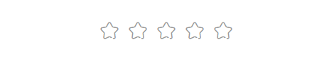

> “🙉🙉🙉 ”

## 前言

经常看到一些'高级'的 CSS 特效，在这边收录一下，以便提高自己。

## 正文

---

渐变背景颜色加转换：

展示：

css 代码：

```
xxx {
    background-image: linear-gradient(to left, #12CBC4, #0652DD, #12CBC4);
    background-size: 200%;
    color: #fff;
    transition: 0.6s;
}
xxx:hover {
    background-position: right;
}
```

重点：利用 CSS3 中的**linear-gradient**函数来创建一个渐变的颜色背景，再用**background-size**属性放大一倍，使显示一半的图像，再在*hover*中使用**background-position**属性控制图像的显示方向从右开始。

PS:关于[linear-gradient](https://www.runoob.com/cssref/func-linear-gradient.html)[background-position](http://www.w3school.com.cn/cssref/pr_background-position.asp)的详细介绍。

---

利用：before/after 做出来的 hover 效果

展示：

css 代码:

```
xxx {
    color: inherit;
    letter-spacing: 1px;
    position: relative;
    margin: 0 3rem;
    padding: 5px 0;
}
xxx:last-child {
    margin-right: 40px;
}
xxx::before,
xxx::after
{
    content: '';
    width: 100%;
    height: 2px;
    background-color: crimson;
    left: 0;
    position: absolute;
    //scale动画
    transform: scaleX(0);
    //设置动画时间
    transition: all .5s;
}
xxx::before
{
    //上半部分
    top: 0;
    //
    transform-origin: left;
}
xxx::after
{
    //下半部分
    bottom: 0;
    transform-origin: right;
}
xxx:hover::before,
xxx:hover::after
{
    transform: scaleX(1);
}
```

重点：利用 _::before_ 和 *::after*属性，不算高级，但是实用。

---

hover 中间图片显示，图片周围区域模糊

展示：

html:

```
<div class="div1"></div>
<div class="div2"></div>
```

css 代码:

```
.div1 {
    // only important one
    position: absolute;
    top: 0;
    left: 0;
    transition: 2s;
    background: ....;
    background-position: center;
    background-attachment: fixed;
}
.div2 {
    // only important one
    position: absolute;
    top: 50%;
    left: 50%;
    transform: translate(-50%,-50%);
    background-position: center;
    z-index: 1;
}
.div2:hover {
    box-shadow: 0 20px 50px rgba(0,0,0,.8);
}
.div2:hover ~ .div1 {
    filter: blur(10px);
}
```

重点: 两张图片利用 position、z-index 重叠，_~_ 是兄弟选择器的符号，表示选定元素后所有的选定元素。同为兄弟选择器的 _+_ 则是选定元素后第一个选定元素。_background-attachment_ 是选择背景图片跟不跟随滑动而滑动。

---

background-image 增加颜色滤镜和阴影

展示：

html:

```
<div class="bg"></div>
```

css:

```
.bg {
    background-image: ......;
}
.bg::after {
    content:'';
    position:absolute;
    top/left: 0;
    width/height: 100%;
    // just for the background, not affect the others.
    z-index: 1;
    // 滤镜
    background: rgba(0,0,0,.6);
    // 阴影，前一段控制左和上，后一段控制右和下。
    box-shadow: inset 100px 100px 100px #000000, inset -100px -100px 100px #000000;
}
```

重点：利用::after 中的 background：rgba 和 box—shadow 实现效果。

---

rate 评分组件

展示：

原理: 看[这里](https://juejin.im/post/5d57adf5f265da03e3697e1b)

核心代码：

```
元素反向排列：
display: flex;
flex-flow: row-reverse;

兄弟元素操作：
input:checked ~ input
```

---

## 后记

—— 24253 记于 2019-3-19
