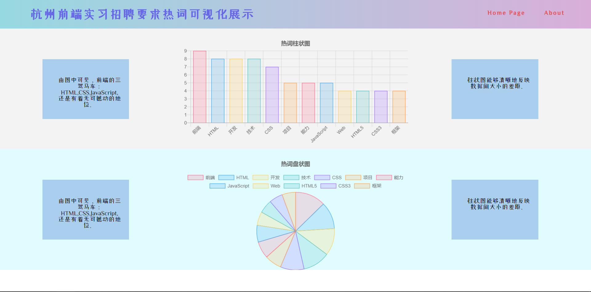

> “🙉🙉🙉 ”

## 前言

由于我最近在想找实习，观察收集了各大公司前端实习岗位要求的信息。所以就想为什么不做一个把这些内容整合起来的网站呢。

把出现频率最高的关键词收集起来并展示出来，如果可以的话，做一个统计图，使呈现更加形象化。

难度适中，适合我这个前端刚入门水平，

---

## 正文

整个项目分成三块：

1. 收集数据并对数据进行处理。

2. 用D3.js把数据进行可视化。

3. 使用Vue创建网站。

---

具体：

1：收集招聘岗位要求文字数据。用Python的jieba库对文本进行分词，再用Python的collection模块中的Counter函数找出其中出现的最多的几个关键词（借鉴的[这里](https://blog.csdn.net/onestab/article/details/78307765)），记录关键词和出现次数。（注：本想用python爬虫收集信息，但是水平不够，想着先用复制下来的代替）

2：D3要从零学起。

3：Vue学习还不够，还不能自由在其中增添代码。

更新(19-5-10)：

1.D3学习比较难，改用更简单的chart.js可视化库。

2.Vue现在还不会，短时间内也不打算学习，所以先用简单的三板斧文件搭建网站。

3.数据最好能用nodejs写爬虫爬取下来。

更新(19-6-10)：

1.已用React初步重构网站。

## 后记

#### 网站现状:

—— 24253 记于 2019-4-14

